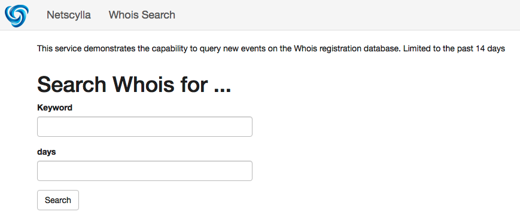
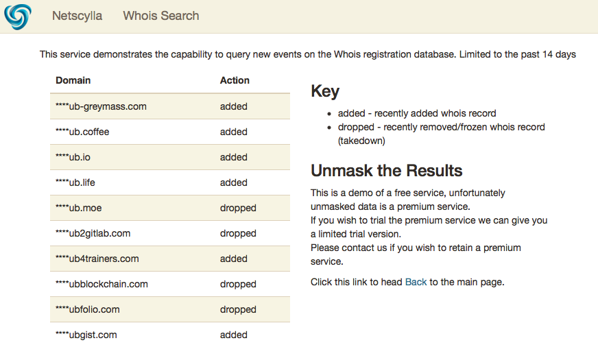

## Introduction
### Phishing & Brand-abuse
One of the biggest security concerns from our customers is web-based phishing campaigns and brand abuse.

Attackers to create fake domains and attempt to legitamise them through signing freely available SSL certificates. A cheaper alternative is usually to attack the brand through subdomains, available cheaper top-level-domains (eg. *.dk, *.vip, *.online), or typo-squatted domains.

Instead of going after gmail.com, its easier for attackers to include other names or keywords and register those domains. E.g examplebanking.com, blahblahgmail.com, blahbanking.tld

We cannot use Certificate Transparency Alerts (ct-alerts) unless the attackers have registered for SSL certificates. Some attackers may choose not to implement SSL inorder to not trigger ct-alerts. Our trusted customers even asked us (Netscylla) if we could improve on our detection and response times, by triggering on the registration of actual domain names, or rather specific keyword's (E.g. their brands, their corporation names, etc).

### Whois Search
At Netscylla we wrote a small program (served as a python flask web application), that allows Threat Hunters to search every few days for newly registered domains.  This is powered through the utilitisation of an API created by another 3rd party.

More information can be found here: [http://whois.netscylla.com](http://whois.netscylla.com)

Note: This is a demo application, which makes use of a free api, but as a result the first 4-characters of each domain-name are masked.

## Whoisxmlapi
Whosisxmlapi have suceeded and outperformed our in-house capability for whois monitoring; therefore we suggest taking a look at their service offerings.

Register for an account at [https://www.whoisxmlapi.com](https://www.whoisxmlapi.com).

## Usage

Edit the Docker file and insert your API key into the APIKEY variable

### Docker
Build the Docker image
```
docker build -t whois .
```
Run the docker image, and portforward TCP/5000
```
docker run -p 5000:5000 whois
```

### Python
For python, use pip to install the required modules, save the api key as an enviroment variable, and use flask to serve the application
```
 python3 -m venv .venv
 source .venv/bin/activate
 pip install -r requirements.txt
 flask run --host 0.0.0.0
```
## Running
In any browser
```
127.0.0.1:5000
```
You should see




